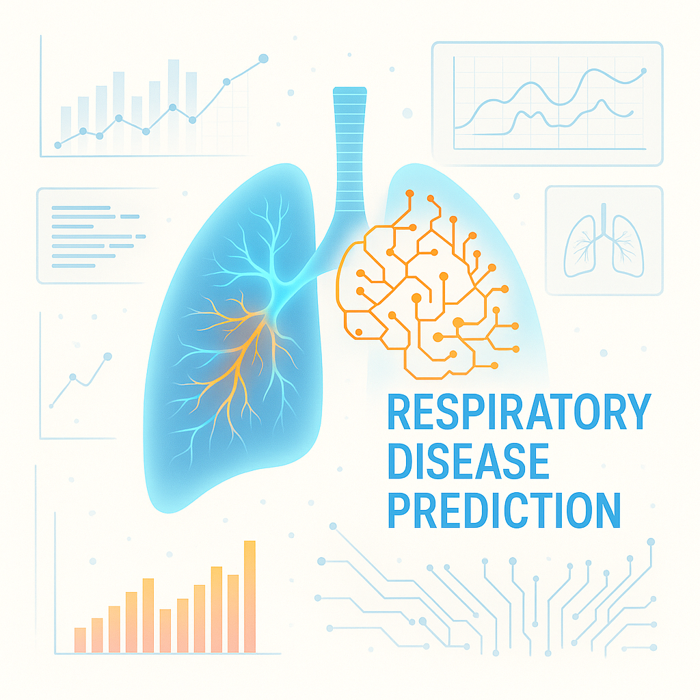
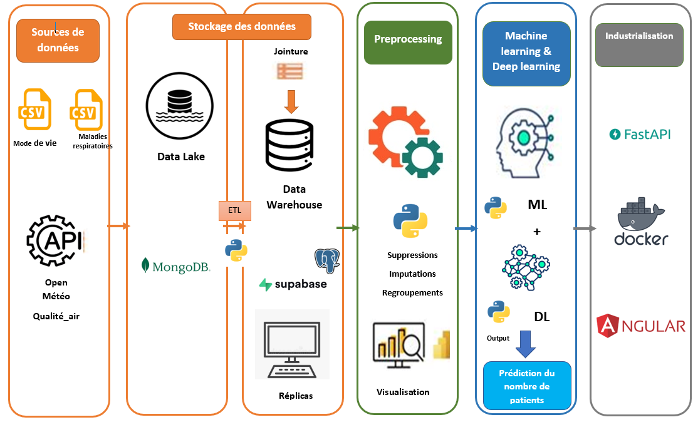
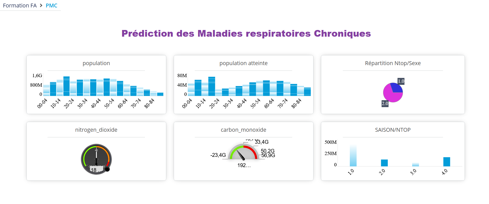

# Project: Predicting Respiratory Disease Risk

---

## Overview

**Goal:**  
Predict the risk of chronic respiratory diseases (such as asthma, COPD) based on individual lifestyle factors and environmental pollution indicators.

---

## Data Sources

- **Lifestyle & Health Data**:  
  - ANSES (anses.fr)  
  - AMELI (ameli.fr)  

- **Pollution Data**:  
  - Open-Météo (PM2.5, NO₂, O₃, weather conditions)

---

## 🔧 Features Considered

- Age, sex, smoking status  
- Physical activity level  
- Air pollution levels (daily/weekly averages)  
- Temperature/humidity  
- Geographic location (urban vs. rural)

---

## Project Architecture

Pipeline:  
1. **Data Collection** – Ameli, ANSES, Open-Météo  
2. **ETL Process** – MongoDB → Transformation → Supabase  
3. **Preprocessing & EDA** – cleaning, normalization, feature engineering  
4. **Machine Learning** – model training  
5. **Deep Learning** – neural networks  
6. **Visualization with DigDash** – interactive dashboards  
7. **Deployment** – [Web app demo](https://pmc-frontend-gvo6.onrender.com/)

---

## 🔗 Notebooks & Code
- [ETL Scripts](https://github.com/AMFATMA/fatmaamor.github.io/blob/master/Projet1/Bloc1/api.py)
- [Preprocessing & Analysis](https://fatmaamor.github.io/Projet1/Bloc2/analyse_preprocessing.ipynb)  
- [Machine Learning](https://fatmaamor.github.io/Projet1/Bloc3/machine_learning.ipynb)  
- [Deep Learning](https://fatmaamor.github.io/projet1/Bloc4/Deep_learning.ipynb)  

---

## Dashboard Preview

---

## 🛠️ Tools & Technologies

 

---

[Home](README.md) | [Contact](contact.md)

